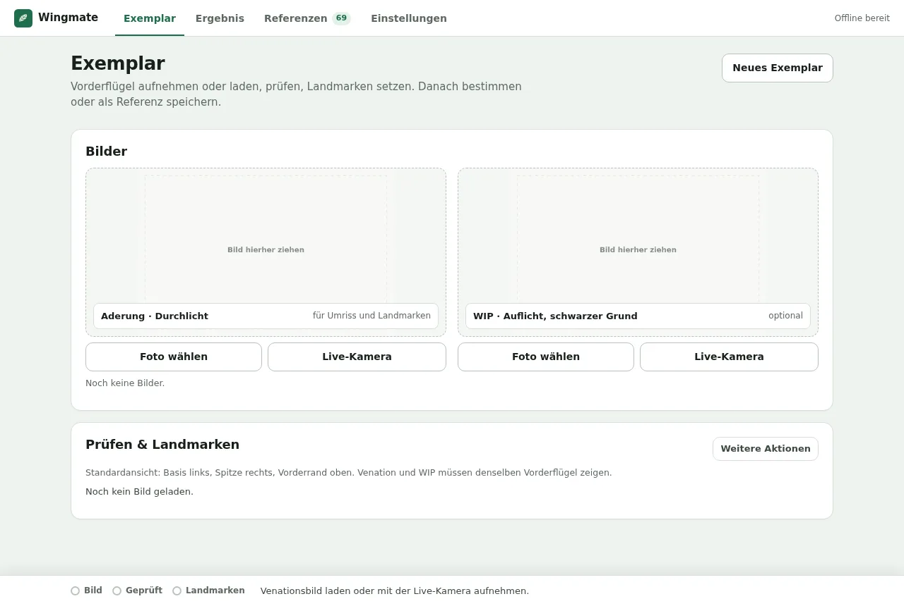
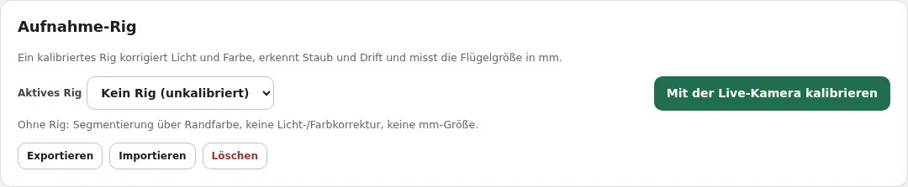
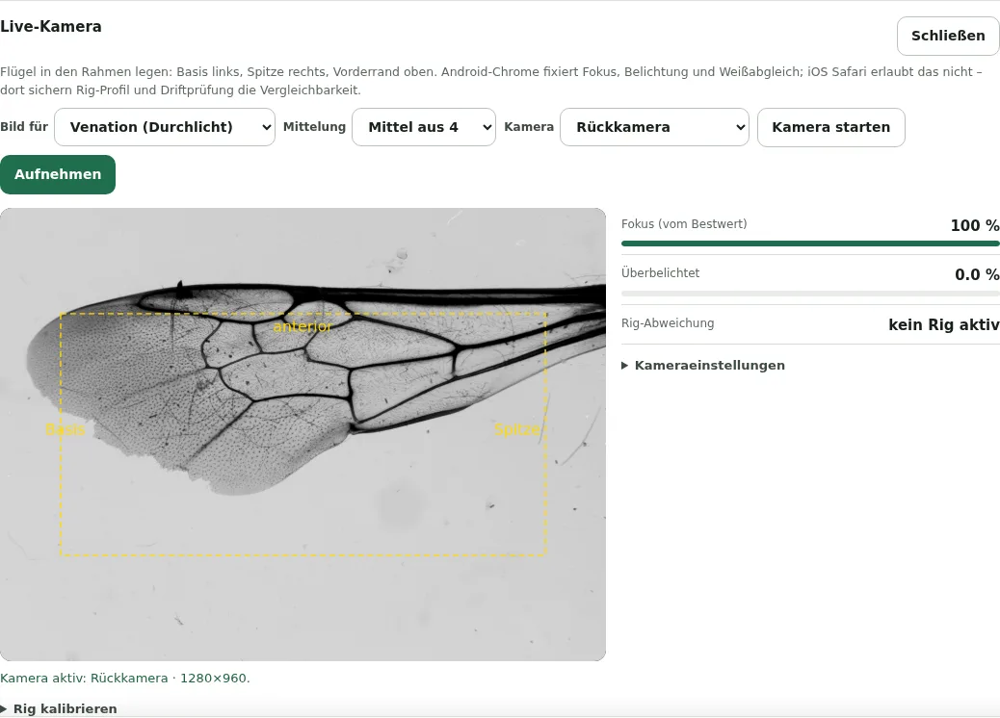
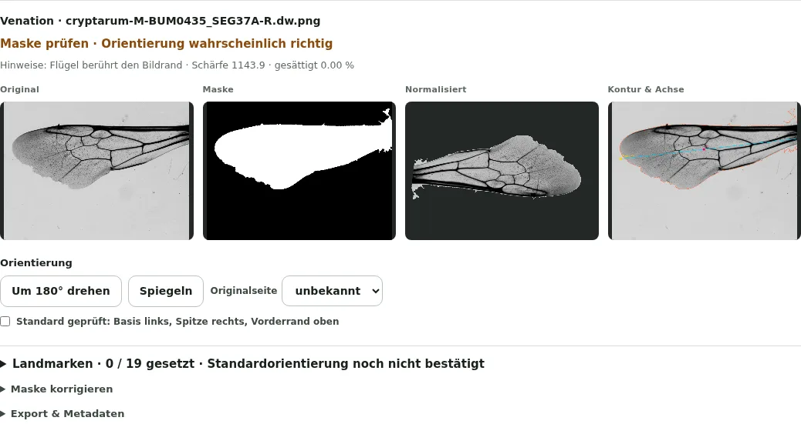
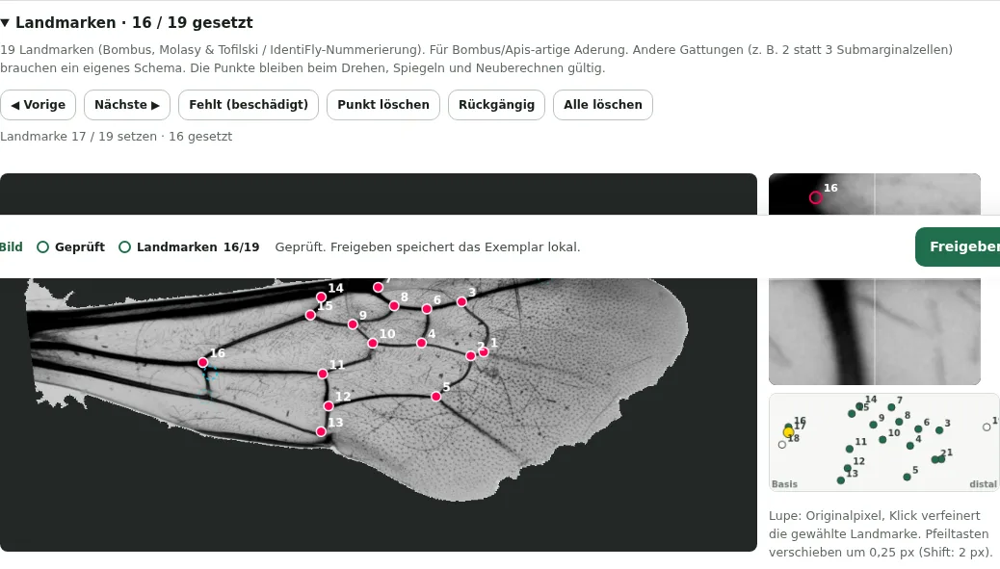
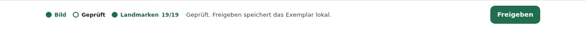
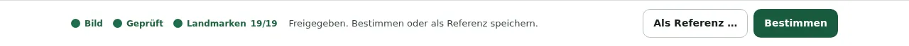
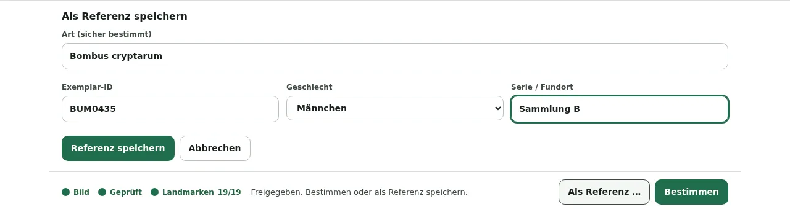
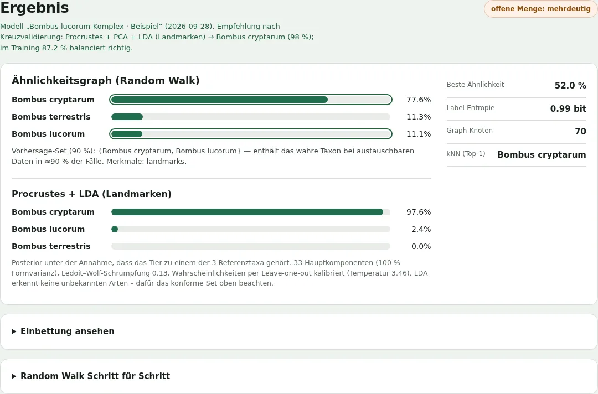
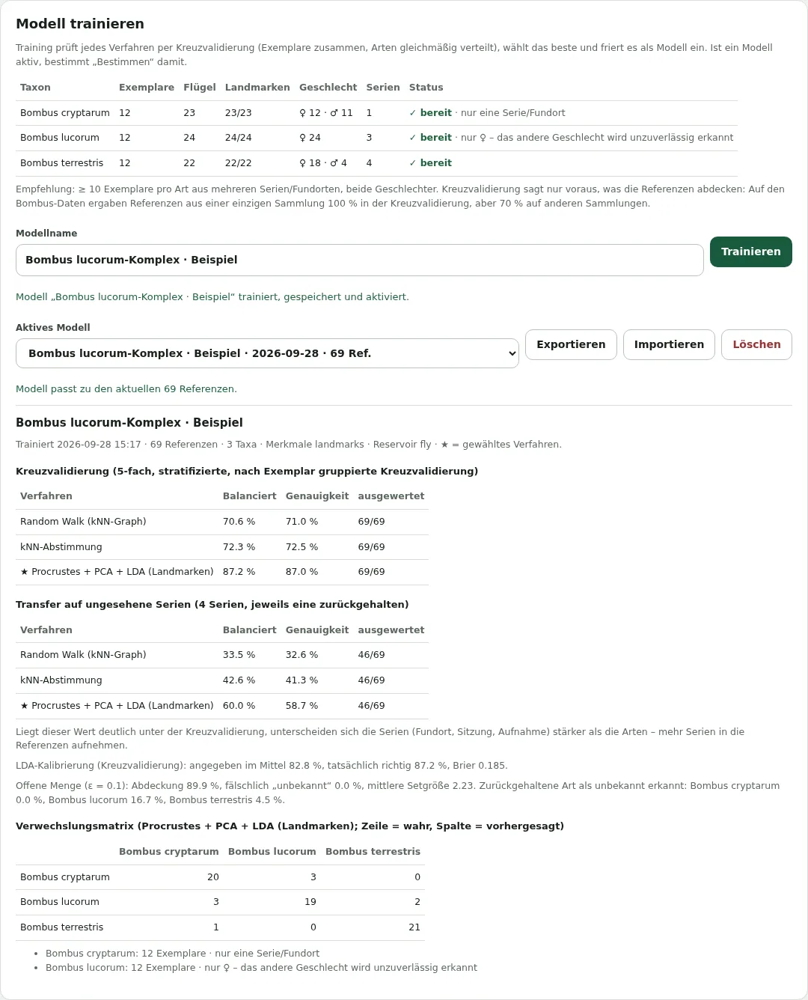

# Wingmate – Benutzerhandbuch

Wingmate bestimmt Wildbienen anhand ihres Vorderflügels: der **Aderung** (Venation, im Durchlicht)
und optional der **Wing Interference Patterns** (WIP, Schillerfarben im Auflicht auf schwarzem
Grund). Die App läuft vollständig im Browser, auch am Smartphone und offline. Bilder, Referenzen und
Modelle verlassen das Gerät nicht.

> **Forschungsprototyp.** Wingmate ersetzt keine taxonomische Bestimmung. Jedes Ergebnis ist ein
> Hinweis mit Unsicherheit; die Qualität hängt direkt von Ihren Referenzen ab (Kapitel 10).

**Inhalt**

1. [Starten](#1-starten)
2. [Die Oberfläche in 1 Minute](#2-die-oberfläche-in-1-minute)
3. [Aufnahme-Rig einrichten und kalibrieren](#3-aufnahme-rig-einrichten-und-kalibrieren)
4. [Ein Exemplar aufnehmen](#4-ein-exemplar-aufnehmen)
5. [Prüfen: Maske und Orientierung](#5-prüfen-maske-und-orientierung)
6. [Landmarken setzen](#6-landmarken-setzen)
7. [Freigeben – und dann: Referenz oder Bestimmung](#7-freigeben--und-dann-referenz-oder-bestimmung)
8. [Das Ergebnis lesen](#8-das-ergebnis-lesen)
9. [Modell trainieren](#9-modell-trainieren)
10. [Gute Referenzen sammeln](#10-gute-referenzen-sammeln)
11. [Daten sichern](#11-daten-sichern)
12. [Einstellungen](#12-einstellungen)
13. [Fehlerbehebung](#13-fehlerbehebung)
14. [Begriffe](#14-begriffe)

---

## 1. Starten

**Am einfachsten:** <https://hofda.github.io/wingmate/> im Browser öffnen – am Computer oder am
Smartphone. Die Adresse ist verschlüsselt (HTTPS), deshalb funktioniert auch die Kamera.

**Als App installieren** (empfohlen fürs Smartphone, danach auch offline nutzbar):

- **Android / Chrome, Desktop:** Browsermenü → *App installieren* (oder *Einstellungen → App →
  App installieren*, sobald der Browser es anbietet).
- **iPhone / iPad (Safari):** *Teilen → Zum Home-Bildschirm*.

Oben rechts steht **Offline bereit**, sobald die App einmal vollständig geladen wurde.
Erscheint **Update laden**, gibt es eine neue Version: vorher laufende Arbeit freigeben oder
exportieren, dann klicken.

**Lokal aus dem Quellcode** (für Entwicklung):

```bash
npm run serve          # Computer: http://localhost:8000
npm run serve:https    # Smartphone im selben WLAN: https://<IP-des-Rechners>:8443
```

Beim HTTPS-Server einmal die Zertifikatswarnung auf dem Smartphone bestätigen.

**Welcher Browser?** Für Aufnahmen mit fixierter Kamera: **Chrome auf Android**. iPhone-Safari
funktioniert, erlaubt Webseiten aber keine manuelle Kamerasteuerung (Kapitel 4).

---

## 2. Die Oberfläche in 1 Minute

Wingmate hat vier Bereiche – am Computer oben, am Smartphone unten:

| Bereich | Wofür |
| --- | --- |
| **Exemplar** | Bild laden oder aufnehmen, prüfen, Landmarken setzen |
| **Ergebnis** | Bestimmung des aktuellen Exemplars |
| **Referenzen** | Ihre sicher bestimmten Exemplare (= Trainingsdaten) und das Modelltraining |
| **Einstellungen** | Aufnahme-Rig, Rechenraum, App, Methodik |

Im Bereich *Exemplar* zeigt die **Leiste am unteren Rand** immer, wo Sie stehen
(**Bild · Geprüft · Landmarken x/19**) und den **nächsten Schritt**. Wenn Sie nicht wissen, was als
Nächstes zu tun ist: auf die Leiste schauen.



Der ganze Ablauf für ein Tier:

1. **Bild** laden oder aufnehmen (Kapitel 4)
2. **Prüfen**: Maske und Orientierung bestätigen (Kapitel 5)
3. **Landmarken** setzen (Kapitel 6, für die zuverlässigste Bestimmung)
4. **Freigeben**, dann **Bestimmen** oder **Als Referenz** speichern (Kapitel 7)

---

## 3. Aufnahme-Rig einrichten und kalibrieren

Ein **Rig** ist Ihr fester Smartphone-Aufsatz: immer gleicher Abstand, gleicher Hintergrund, gleiches
Licht. Wingmate kann ein Rig einmal **kalibrieren** und korrigiert danach jede Aufnahme automatisch:
ungleichmäßiges Licht und Farbstich werden ausgeglichen, Staub auf Glas oder Diffusor stört die
Flügelerkennung nicht mehr, Abweichungen (Rig verrutscht, Licht geändert) werden gemeldet, und mit
einem Maßstab misst die App die **Flügellänge in mm**.

Ohne Rig funktioniert die App auch – dann ohne diese Korrekturen und ohne mm-Größe.

### Hinweise für den Bau

Ein fertiges, 3D-druckbares Rig für iPhone-Makro mit LED-Leuchtkasten liegt in
[`rig/`](../rig/README.md) (STL, Teileliste, Montage, Kalibrierung).

- Flügel **flach zwischen Objektträger und Deckglas** (ein Tropfen 70 % Ethanol hilft beim Glätten),
  in einem festen Schlitz auf der Fokusebene.
- **Venation:** gleichmäßiges, diffuses Durchlicht (LED-Panel mit Opal-Diffusor). LEDs mit
  **Konstantstrom, ohne PWM-Dimmung** – PWM erzeugt Streifen im Bild, die sich nicht herausrechnen lassen.
- **WIP:** lichtschluckender schwarzer Untergrund (Velours/Flock), Auflicht unter **festem Winkel**.
  WIP-Farben ändern sich mit Licht- und Blickwinkel.
- Gehäuse geschlossen halten (kein Umgebungslicht), Lampen mit hoher Farbwiedergabe (CRI ≥ 90).
- Makro-Vorsatz fest auf der **Hauptkamera**; manche iPhones wechseln im Nahbereich sonst
  selbstständig das Objektiv.

### Kalibrieren

1. Rig montieren, Licht an.
2. *Einstellungen → Aufnahme-Rig → **Mit der Live-Kamera kalibrieren*** (oder im Bereich *Exemplar*
   bei einem Bildfeld **Live-Kamera** und dort **Rig kalibrieren** aufklappen).
3. Kamera einpendeln lassen, dann unter *Kameraeinstellungen* **Aktuelle Einstellungen fixieren**
   (nur Android-Chrome).
4. Die Kalibrierschritte nacheinander **Aufnehmen** – jeweils ohne Flügel:
   - **Venation-Hintergrund:** leerer Objektträger im Durchlicht *(nötig für Venation)*
   - **WIP-Hintergrund:** leer, schwarzer Grund, Auflicht *(nötig für WIP)*
   - **WIP-Graukarte:** neutrale Graukarte an der Flügelposition *(optional, verbessert WIP-Farben)*
   - **Maßstab:** Lineal oder Objektmikrometer an der Flügelposition; im Bild **zwei Punkte
     anklicken** und ihren Abstand in mm eintragen *(optional, für mm-Größe)*
5. Namen eingeben, **Rig speichern & aktivieren**.

Jede Hintergrundaufnahme mittelt 16 Bilder. Das Profil gilt **nur für genau diese Auflösung,
Zoomstufe und Beleuchtung**. Nach einem Wechsel von Lampe, Diffusor, Vorsatzlinse oder Telefon neu
kalibrieren. Unter *Einstellungen → Aufnahme-Rig* können Sie Rigs wählen, **exportieren** (z. B.
für ein zweites Gerät), **importieren** und löschen.



---

## 4. Ein Exemplar aufnehmen

Im Bereich **Exemplar → Bilder** gibt es zwei Felder:

- **Aderung · Durchlicht** – das Hauptbild; nötig für Landmarken
- **WIP · Auflicht, schwarzer Grund** – optional

Zu jedem Feld gibt es zwei Wege:

**Foto wählen** öffnet eine Bilddatei. Am Smartphone bietet der Browser dabei auch die
**Kamera-App** an (volle Auflösung; in der Kamera-App Fokus/Belichtung per langem Tippen sperren).
Am Computer können Sie ein Bild auch ins Feld **ziehen**.

**Live-Kamera** nimmt direkt in Wingmate auf:



1. Den Flügel in den **gelben Rahmen** legen: **Basis links, Spitze rechts, Vorderrand oben**.
2. Auf die Anzeigen rechts achten:
   - **Fokus (vom Bestwert):** möglichst nahe 100 %. Der Wert ist relativ zum schärfsten Bild dieser Sitzung.
   - **Überbelichtet:** sollte 0 % sein. Überbelichtete Stellen im Flügel sind verlorene Information.
   - **Rig-Abweichung:** mit aktivem Rig; ⚠ bedeutet, dass Licht oder Position vom Profil abweichen.
3. **Mittelung** wählen (Standard: *Mittel aus 4*). Mehr Bilder = weniger Rauschen; das Tier muss
   dabei ruhig liegen.
4. **Aufnehmen**. Das Bild erscheint im Feld und wird sofort verarbeitet.

Unter **Kameraeinstellungen** lassen sich (auf Android) Fokusdistanz, Belichtung, Weißabgleich, ISO,
Zoom und Taschenlampe einstellen und mit **Aktuelle Einstellungen fixieren** sperren. Ein aktives Rig
stellt diese Werte beim nächsten Start automatisch wieder ein.

**Neues Exemplar** (oben rechts) leert beide Felder für das nächste Tier.

---

## 5. Prüfen: Maske und Orientierung

Unter **Prüfen & Landmarken** zeigt Wingmate für jedes Bild:



- eine **Einschätzung**, z. B. *Maske plausibel · Orientierung wahrscheinlich richtig*, oder
  *Prüfhinweise vorhanden* mit Hinweisen darunter (z. B. „Flügel berührt den Bildrand“);
- vier Ansichten: **Original**, **Maske** (weiß = erkannter Flügel), **Normalisiert** (ausgerichtet
  auf 1024 × 512 Pixel) und **Kontur & Achse**.

**Was Sie prüfen:**

1. **Maske:** Ist der ganze Flügel weiß und nichts anderes? Wenn nicht → *Maske korrigieren*
   aufklappen: die **Segmentierungsschwelle** ändern oder eine selbst korrigierte Schwarz-Weiß-Maske
   importieren. *Alle Korrekturen zurücksetzen* stellt den Ausgangszustand her.
2. **Orientierung** im Bild *Normalisiert*: **Basis links, Spitze rechts, Vorderrand oben.**
   - Falsch herum? **Um 180° drehen**.
   - Vorderrand unten? **Spiegeln**. (Linke und rechte Flügel sind Spiegelbilder; durch das
     Spiegeln werden sie vergleichbar.)
   - **Originalseite** (links/rechts) angeben, falls bekannt – sie bleibt dokumentiert.
3. Passt alles: **Standard geprüft** ankreuzen.
4. Bei Prüfhinweisen die **Freigabebegründung** ausfüllen: dokumentieren, warum die Aufnahme
   trotz Hinweis verwendbar ist. Ein plausibler Umriss allein belegt keine nutzbare Aderung.

Bei zwei Bildern (Venation + WIP) richtet Wingmate das WIP-Bild automatisch am Venationsbild aus
und zeigt die Überlagerung. Beide müssen **denselben Vorderflügel desselben Tieres** zeigen.
Der automatische Abgleich prüft nur die Kontur. Innere Adern vergleichen und die Bestätigung
unter der Überlagerung ankreuzen, bevor das Bildpaar freigegeben wird.

Weniger Gebrauchtes: *Export & Metadaten* (normalisiertes Bild, Maske, alle Transformationen) und
oben rechts *Weitere Aktionen* (Neu berechnen, Metadaten-Export, Landmarken als CSV, Achsen
und Rahmen einblenden). **Letztes Exemplar öffnen** steht unter den Aufnahmefeldern.

---

## 6. Landmarken setzen

**Landmarken** sind 19 feste Punkte an Aderkreuzungen. Ihre Lage beschreibt die Flügelform – das
ist die bewährteste Grundlage für die Bestimmung (geometrische Morphometrie). Ohne Landmarken
bestimmt Wingmate nur mit Bildmerkmalen. Deren Zuverlässigkeit muss für Ihre Arten und
Aufnahmebedingungen separat geprüft werden.

In der Prüfkarte des Venationsbildes **Landmarken** aufklappen:



**So geht's:**

1. Oben steht, welche Landmarke dran ist (*Landmarke 17 / 19 setzen*). Die **Übersicht** rechts
   unten zeigt, wo sie beim mittleren Flügel liegt (gelb = aktuelle).
2. Im großen Bild **ungefähr auf die Stelle tippen**. Die Landmarke wird gesetzt, die nächste ist dran.
3. In der **Lupe** (Originalpixel, 6-fach vergrößert) **genau auf die Aderkreuzung klicken** –
   das verfeinert den Punkt und springt weiter.

**Hilfen:**

- Ab 2 Punkten zeigen **gestrichelte Kreise**, wo die nächsten Landmarken zu erwarten sind.
- Ab 4 Punkten werden Punkte **orange**, die stark vom üblichen Muster abweichen – meist vertauschte
  Nummern. Bei anderen Gattungen kann das auch normal sein.

**Korrigieren:**

- Einen Punkt **ziehen**, um ihn zu verschieben. (Nur Ziehen verschiebt – so lassen sich auch dicht
  beieinander liegende Landmarken wie 1/2 oder 16/17 setzen.)
- Einen gesetzten Punkt antippen, um ihn auszuwählen; in der Lupe verfeinern.
- **◀ Vorige / Nächste ▶**, **Punkt löschen**, **Rückgängig**, **Alle löschen**.
- **Fehlt (beschädigt):** Landmarke nicht bestimmbar. Unvollständige Sätze gehen nicht in die
  Formanalyse ein.

**Tastatur** (Bild vorher anklicken): Pfeiltasten verschieben um 0,25 px (mit Shift 2 px),
`n` / `p` nächste / vorige Landmarke, `Strg+Z` rückgängig, `Entf` Punkt löschen.

Die Punkte bleiben beim Drehen, Spiegeln und Neuberechnen erhalten.

**Schema:** Wingmate nutzt die 19 Landmarken des *Bombus*-Datensatzes von Molasy & Tofilski
(IdentiFly-Nummerierung). Es passt für Bombus/Apis-artige Aderung; Gattungen mit anderer Aderung
(z. B. zwei statt drei Submarginalzellen) brauchen ein eigenes Schema.

---

## 7. Freigeben – und dann: Referenz oder Bestimmung

Sind Maske und Orientierung geprüft, zeigt die Leiste **Freigeben**:



**Freigeben** speichert das Exemplar lokal (Originaldateien, Maske, normalisiertes Bild,
Transformation, Landmarken). Danach bietet die Leiste zwei Wege:



### a) Als Referenz speichern – wenn die Art sicher bekannt ist

**Als Referenz …** öffnet ein kurzes Formular:



| Feld | Bedeutung |
| --- | --- |
| **Art** | Nur eintragen, wenn **sicher bestimmt** (z. B. genetisch oder durch Fachleute). |
| **Exemplar-ID** | Gleiche ID für **linken und rechten Flügel desselben Tieres**. So vergleicht die Auswertung nie ein Tier mit sich selbst. |
| **Geschlecht** | Weibchen / Männchen. Flügel unterscheiden sich zwischen den Geschlechtern. |
| **Serie / Fundort** | Sammlung, Fundort oder Aufnahmesitzung. Wichtig, um zu prüfen, ob die Bestimmung auch auf neuen Serien funktioniert (Kapitel 9). |

**Referenz speichern**. Danach **Neues Exemplar** für das nächste Tier.

### b) Bestimmen – wenn die Art gesucht ist

**Bestimmen** wechselt zum Bereich *Ergebnis*. Ist ein trainiertes Modell aktiv, heißt der Knopf
**Mit Modell bestimmen**.

Nach dem Freigeben geänderte Landmarken heben die Freigabe auf – dann erneut **Freigeben**.

---

## 8. Das Ergebnis lesen



**Die Zeile ganz oben** ist die Empfehlung. Mit aktivem Modell steht dort, welches Verfahren sich
im Training am besten bewährt hat, seine Antwort und wie oft es im Training richtig lag, z. B.:
*Procrustes + PCA + LDA → Bombus cryptarum (98 %); im Training 87,2 % balanciert richtig.*

Darunter zwei Verfahren:

**Ähnlichkeitsgraph (Random Walk)** vergleicht das Tier mit allen Referenzen. Die Balken zeigen, wie
viel „Ähnlichkeit“ auf jede Art entfällt (bereinigt um die Zahl der Referenzen je Art). Dazu das
**Vorhersage-Set**: die Arten, die mit dem Exemplar vereinbar sind; grün umrandete Balken
gehören dazu. Im eingefrorenen Modell ist 90 % die angestrebte Abdeckung unter vergleichbaren
Aufnahmebedingungen und mit genügend unabhängigen Kalibrierungstieren. Die Live-Bestimmung
verwendet eine explorative Heuristik ohne diese Abdeckungsgarantie.

**Procrustes + LDA (Landmarken)** vergleicht nur die Flügelform. Die Prozentwerte sind
**temperaturkalibriert** anhand der Trainingsgruppen. Die Prozentwerte sind geschätzte
Konfidenzen; ihre Zuverlässigkeit muss an unabhängigen Tieren geprüft werden. Sie gelten aber
nur **unter der Annahme, dass das Tier zu einer Ihrer Referenzarten gehört**.

**Das Feld „offene Menge“** oben rechts beantwortet die Frage „Ist das überhaupt eine bekannte Art?“:

| Anzeige | Bedeutung |
| --- | --- |
| **eindeutig** | Nur eine Art passt. |
| **mehrdeutig** | Mehrere Arten passen; die Bestimmung ist nicht sicher (häufig bei nahe verwandten Arten). |
| **keiner Art ähnlich** | Das Exemplar ist untypischer als fast alle Referenzen jeder Art: mögliche neue Art, Aufnahmefehler oder Lücke in den Referenzen. |
| **nicht kalibriert** | Live-Bestimmung oder mindestens eine Art mit weniger als 9 getrennten Kalibrierungstieren. Eine belastbare Entscheidung über unbekannte Arten ist damit nicht möglich. |

**So entscheiden Sie:** Stimmen Empfehlung, Ähnlichkeitsgraph und LDA überein und ist die offene
Menge *eindeutig*, ist das Ergebnis gut gestützt. Widersprechen sie sich oder ist sie *mehrdeutig*,
das Tier als unsicher behandeln. Warnungen wie „Nur 3 Exemplar(e) im kleinsten Taxon“ ernst nehmen.

Rechts stehen Kennzahlen (beste Ähnlichkeit, Entropie, Knoten, kNN-Vergleich). Eingeklappt:
**Einbettung ansehen** (2D-Karte der Referenzen, keine Stammbaumdarstellung) und **Random Walk Schritt
für Schritt** (Animation des Rechenwegs).

---

## 9. Modell trainieren

Ohne Modell rechnet Wingmate jede Bestimmung **live** aus den aktuellen Referenzen. Mit
**Referenzen → Modell trainieren** wird daraus ein festes **Modell** mit Entwicklungsbewertung:



**1. Bereitschaft prüfen.** Unter **Referenzbereitschaft & Trainingsverfahren** zeigt die Tabelle je Art Exemplare, Flügel, Landmarken, Geschlecht und
Serien:

- ✓ **bereit:** mindestens 10 Exemplare
- ⚠ weniger als 10 · ✗ weniger als 5 Exemplare
- Hinweise wie **nur ♀** oder **nur eine Serie/Fundort** bedeuten, dass das Modell andere
  Geschlechter bzw. neue Fundorte schlechter erkennen wird.

**2. Trainieren.** Namen eingeben, **Trainieren**. Wingmate prüft alle Verfahren mit derselben
**Kreuzvalidierung**: Die Referenzen werden fünfmal aufgeteilt, jedes Mal wird ein Fünftel
zurückgehalten und bestimmt. Alle Flügel eines Tieres bleiben dabei zusammen. Das beste Verfahren
wird gewählt (★) und das Ergebnis eingefroren. Ausrichtung, Skalierung und PCA/LDA werden
in jedem Trainingsfold neu angepasst. Separate Tiere dienen ausschließlich der Kalibrierung
(standardmäßig 20 % je Art). Die angezeigten Auswahlwerte ersetzen keinen unabhängigen
Abschlusstest. Zehn Referenztiere bedeuten deshalb noch keine ausreichende Kalibrierung.

**3. Den Bericht lesen:**

- **Kreuzvalidierung:** Anteil richtig bestimmter zurückgehaltener Exemplare. *Balanciert* heißt:
  jede Art zählt gleich viel, auch wenn eine Art viel mehr Referenzen hat.
- **Transfer auf ungesehene Serien** (nur wenn alle Referenzen eine Serie haben): Jeweils eine
  ganze Serie wird zurückgehalten. **Liegt dieser Wert deutlich unter der Kreuzvalidierung** (im Bild
  60 % statt 87 %), unterscheiden sich Ihre Serien stärker als die Arten – mehr Serien sammeln.
  Diese Zahl ist die ehrlichere Schätzung für neue Fundorte.
- **LDA-Kalibrierung:** angegebene vs. tatsächliche Trefferquote – sollten nahe beieinander liegen.
- **Offene Menge:** wie oft die wahre Art im Vorhersage-Set war und wie oft bekannte Tiere
  fälschlich als „unbekannt“ abgewiesen wurden. Die Erkennung unbekannter Arten benötigt einen
  separaten Test mit vollständig zurückgehaltenen Taxa.
- **Verwechslungsmatrix:** Zeile = wahre Art, Spalte = Vorhersage. Zahlen außerhalb der Diagonale
  zeigen, welche Arten verwechselt werden.

**4. Modelle verwalten.** Unter **Aktives Modell** wählen (oder *Kein Modell* für die
Live-Bestimmung), unter **Modelle verwalten** **Exportieren** (eine JSON-Datei, z. B. zum Weitergeben),
**Importieren** oder **Löschen** wählen.

Ein Modell ändert sich nicht von selbst. Kommen neue Referenzen dazu, erscheint
*„Referenzen haben sich seit dem Training geändert“* → neu trainieren.

---

## 10. Gute Referenzen sammeln

Die Bestimmung hängt von Qualität und Vielfalt der Referenzen ab. Die lokalen
Landmarken-Benchmarks sind Entwicklungsvergleiche, keine unabhängigen Genauigkeitsnachweise:

- **Mindestens 10 Exemplare pro Art** ist ein Bereitschaftshinweis. Die nötige Datenmenge
  hängt von Artengruppe und Aufnahmebedingungen ab. Für die p-Wert-Auflösung bei ε = 0,1
  benötigt das eingefrorene Modell mindestens neun unabhängige **Kalibrierungstiere** je Art,
  zusätzlich zu den Trainingstieren.
- **Mehrere Serien/Fundorte pro Art.** Prüfen Sie den Transferbericht. Neue Aufnahmesitzungen
  und Sammlungen können deutlich schlechter erkannt werden als die Entwicklungsdaten.
- **Beide Geschlechter.** Nur Weibchen als Referenz kostete bei Männchen rund 6 Prozentpunkte.
- **Unterschiedliche Tiere, nicht Wiederholungen:** Linker und rechter Flügel desselben Tieres
  zählen als *ein* Exemplar (gleiche Exemplar-ID).
- **Immer gleich aufnehmen:** dasselbe Rig, dieselbe Einstellung, dieselbe Orientierung.
- **Nur sicher bestimmte Tiere** als Referenz. Eine falsche Referenz schadet mehr als eine fehlende.

---

## 11. Daten sichern

Alles liegt **nur in diesem Browser auf diesem Gerät**:

| Daten | Ort | Sichern mit |
| --- | --- | --- |
| Referenzen | Browser-Speicher (localStorage) | *Referenzen → Sammlung → Sammlung verwalten → Exportieren* |
| Freigegebene Exemplare (Originale, Masken, Landmarken) | Browser-Datenbank (IndexedDB) | *Prüfen → Weitere Aktionen → Metadaten & Maske exportieren*, *Landmarken als CSV* |
| Modelle | IndexedDB | *Modell trainieren → Exportieren* |
| Rig-Profile | IndexedDB | *Einstellungen → Aufnahme-Rig → Exportieren* |

Browserdaten löschen, privates Surfen oder ein anderer Browser bedeuten: **die Daten sind weg.**
Deshalb **Referenzen regelmäßig exportieren**. Auf einem anderen Gerät über *Importieren* einlesen;
bereits vorhandene Referenzen werden dabei nicht doppelt angelegt.

Die Landmarken-CSV (`file,x1,y1,…,x19,y19`, Originalpixel) lässt sich in MorphoJ, geomorph oder
IdentiFly weiterverwenden.

---

## 12. Einstellungen

- **Aufnahme-Rig:** siehe Kapitel 3.
- **Rechenraum (Reservoir):** wie der Ähnlichkeitsgraph die Merkmale vergleicht. Standard ist
  *FlyHash* (nach dem Riechsystem der Fruchtfliege); *Kein Reservoir* und *Dichte Zufallsprojektion*
  sind Vergleichsverfahren. **Für normale Nutzung nichts ändern.** Änderungen gelten für die
  Live-Bestimmung und neues Training, nicht für ein bereits trainiertes Modell.
- **FlyWire-Subgraph importieren:** experimentell, für Forschungsfragen zum echten
  Fliegen-Konnektom; wird nicht in Modelle eingefroren.
- **App:** Installationshinweise.
- **Methodik:** Kurzbeschreibung der Verfahren. Ehrlich festgehalten: Auf den getesteten
  *Bombus*-Daten ist die Landmarken-Methode (Procrustes + LDA) besser als der Ähnlichkeitsgraph, und
  FlyHash bringt gegenüber den Vergleichsverfahren keinen Vorteil.

---

## 13. Fehlerbehebung

| Problem | Lösung |
| --- | --- |
| **„Kamera nur über HTTPS oder localhost verfügbar“** | Die App über <https://hofda.github.io/wingmate/> oder `npm run serve:https` öffnen. |
| Kamera startet nicht | Kamerazugriff für die Seite im Browser erlauben; andere Apps, die die Kamera nutzen, schließen. |
| **„Keine manuellen Kamerasteuerungen verfügbar“** | Normal auf iPhone/Safari und vielen Webcams. Rig kalibrieren und auf die *Rig-Abweichung* achten, oder *Foto wählen* → Kamera-App mit AE/AF-Sperre. |
| **„Rig … nicht angewendet: Bild … Profil …“** | Das Bild hat eine andere Auflösung als das Rig-Profil (andere Kamera, anderer Zoom, Foto aus der Kamera-App). Mit der Live-Kamera aufnehmen oder das Rig für diese Auflösung neu kalibrieren. |
| **„Licht/Hintergrund weicht vom Rig-Profil ab“** | Rig verrutscht, Lampe geändert oder Umgebungslicht. Aufbau prüfen; bei dauerhafter Änderung neu kalibrieren. |
| **„Prüfhinweise vorhanden“ / Flügel nicht richtig erkannt** | *Maske korrigieren*: Schwelle ändern oder korrigierte Maske importieren. Mit kalibriertem Rig tritt das seltener auf. |
| **„Überbelichtung im Flügel“** | Belichtung verringern bzw. Licht dimmen und neu aufnehmen. |
| **Freigeben** bleibt grau | Bei jedem Bild **Standard geprüft** ankreuzen. Bei Prüfhinweisen zusätzlich eine Freigabebegründung eingeben; bei Bildpaaren denselben Flügel und innere Entsprechung bestätigen. |
| **Bestimmen** fehlt | Erst **Freigeben**. |
| **„… keine gemeinsamen Merkmale“** | Exemplar und Referenzen wurden unterschiedlich erfasst, z. B. Referenzen nur mit Landmarken. Für dieses Exemplar alle Landmarken setzen und neu freigeben. |
| **„Das Modell braucht Merkmale, die dieser Aufnahme fehlen“** | Das aktive Modell wurde z. B. mit Landmarken trainiert: Landmarken vollständig setzen (und Orientierung bestätigen) – oder ein anderes Modell wählen. |
| Landmarken lassen sich nicht setzen | Die Karte **Landmarken** gibt es nur am Venationsbild (ohne Venation am WIP-Bild). Zum Verschieben ziehen, zum Setzen tippen. |
| **„offene Menge: nicht kalibriert“** | Ein Modell mit separaten Kalibrierungstieren trainieren. Für ε = 0,1 sind mindestens neun Kalibrierungstiere je Art nötig; doppelte Flügel erhöhen diese Zahl nicht. |
| Referenzen nach Neustart weg | Browserdaten wurden gelöscht oder ein anderer Browser/privates Fenster benutzt. Export einlesen (Kapitel 11). |
| „Alte Referenzen (nur Embeddings, Format v1)“ | Referenzen einer sehr frühen Version – nicht mehr vergleichbar. Mit denselben Bildern neu anlegen. |
| Neue Version wird nicht angezeigt | Auf **Update laden** klicken oder alle App-Fenster schließen und neu öffnen. |

---

## 14. Begriffe

| Begriff | Erklärung |
| --- | --- |
| **Venation** | Flügeladerung, im Durchlicht aufgenommen. |
| **WIP** | *Wing Interference Patterns* – Schillerfarben dünner Flügelmembranen, auf schwarzem Grund im Auflicht sichtbar. |
| **Maske** | Die Fläche, die Wingmate als Flügel erkannt hat. |
| **Standardansicht** | Basis links, Spitze rechts, Vorderrand oben; alle Flügel werden so ausgerichtet. |
| **Landmarke** | Fester, wiederfindbarer Punkt auf dem Flügel (meist eine Aderkreuzung). |
| **Procrustes** | Verfahren, das Landmarken-Sätze in Lage, Größe und Drehung angleicht, sodass nur die Form verglichen wird. |
| **LDA** | Lineare Diskriminanzanalyse – klassisches Verfahren, das Arten anhand der Form trennt. |
| **Referenz** | Sicher bestimmtes Exemplar, mit dem verglichen wird. |
| **Exemplar** | Ein Tier. Mehrere Flügel desselben Tieres = ein Exemplar. |
| **Serie** | Sammlung, Fundort oder Aufnahmesitzung. |
| **Kreuzvalidierung** | Prüfung, bei der ein Teil der Referenzen zurückgehalten und bestimmt wird. |
| **Balancierte Genauigkeit** | Mittlere Trefferquote über alle Arten; jede Art zählt gleich. |
| **Vorhersage-Set / offene Menge** | Arten, die mit dem Exemplar vereinbar sind. Im eingefrorenen Modell: Zielabdeckung 90 % bei gültiger Kalibrierung und vergleichbaren Tieren; live nur Heuristik. Leer = keiner bekannten Art ähnlich. |
| **Kalibriert** | Angegebene Wahrscheinlichkeiten entsprechen ungefähr den tatsächlichen Trefferquoten. |
| **Rig** | Fester Aufnahmeaufbau aus Smartphone, Optik, Licht und Hintergrund. |
| **Flat-Field-Korrektur** | Ausgleich ungleichmäßiger Beleuchtung anhand eines leeren Referenzbildes. |
| **Modell** | Eingefrorenes Ergebnis eines Trainings; bestimmt, bis Sie es wechseln oder neu trainieren. |
| **FlyHash / Reservoir** | Von der Fruchtfliege inspirierte Art, Merkmale zu vergleichen (experimentell). |

---

*Screenshots: echte App mit echten Flügeldaten (Molasy & Tofilski, Zenodo 19703357), erzeugt mit
`scripts/manual-screenshots.cjs`.*
