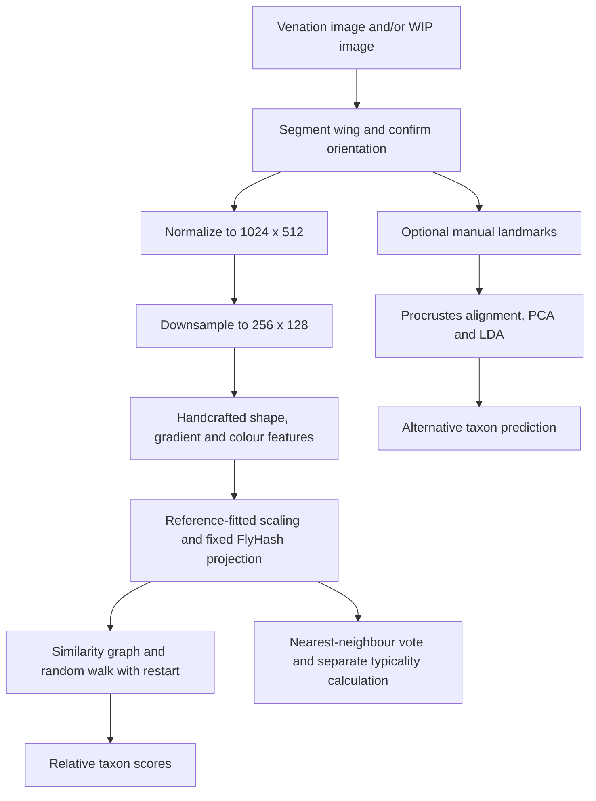

# Bee wing identification: pipeline audit

Reviewed 2026-10-07 against base commit `d43485e` and the current working tree. Scope: image processing, feature extraction, training, validation, identification and result interpretation. Physical capture hardware is outside scope. This review adds diagnostics and documentation; it does not change the classifier or imaging behaviour.

The app is a useful research prototype. Its current evaluation and calibration do not establish reliable identification of new bee specimens. The first blockers are leakage between training and validation, calibration that counts wing records instead of independent animals, and insufficient evidence for combined venation/WIP identification. The random-walk recurrence itself is consistent with its intended definition at the default settings.

## First remediation pass

The findings below record the pre-fix review. The current implementation now:

- Refits alignment, scaling, PCA/LDA and nested landmark temperature calibration inside training groups, including collection holdouts. The live validation path uses the same grouped evaluator.
- Reserves separate calibration animals per taxon, using one maximum wing nonconformity score per animal. Repeated records do not create independent calibration samples. Query typicality uses the same frozen training representation and animal-aware neighbours. Live jackknife is explicitly heuristic and cannot enable calibrated unknown decisions.
- Requires stable animal IDs when adding references and when evaluating/training; detects conflicting labels and exact-image reuse under another identity.
- Requires an explicit input contract when diagnostic modalities are incomplete; venation-only and paired venation/WIP modes are available.
- Measures image detail in an eroded interior and excludes the interpolation halo from colour/vein descriptors. Uniform silhouettes have zero vein features and are marked for review. Review overrides require a stored reason, and paired images require same-wing/internal-correspondence confirmation.
- Uses model format `wingmate-model-2`, complete reservoir/classifier parameters, enforced feature/preprocessing contracts and content fingerprints. Old models require retraining; old image references need reprocessing from archived originals.
- Replaces the globally fitted landmark benchmark with five-fold grouped development evaluation, including training-group-only alignment and nested temperature fitting.

The calibration aggregation is conservative for a single-wing query: the calibration score is the maximum across that animal's available wings. Coverage still requires comparable animals and a consistent view-acquisition policy; adding arbitrary numbers or types of views is not a general exchangeability guarantee. Independent final testing, held-out-species evaluation, expert-labelled real paired WIP data and an actual learned image encoder remain future work. Development method selection is labelled as such in the UI.

Run `node scripts/audit-pipeline.mjs` to inspect current behaviour. Its output now shows corrected/rejected cases rather than reproducing the old failures.

## Follow-up verification (2026-10-08)

The read-only audit probes and Node suite pass against the remediation implementation. The probes show identical animal counts and p-values after wing duplication, matching fold-only fitting results, explicit rejection of incomplete modalities and feature-version mismatches, enforcement of saved classifier settings, and zero vein features for the uniform silhouette.

The remaining interface findings are addressed in [the UI remediation record](img/uifix.md). The user manual now distinguishes live heuristic typicality from frozen-model split calibration and counts independent calibration animals rather than reference wings.

Independent final testing, unseen-taxon testing, real paired WIP evidence, anatomical correspondence validation and learned image features remain research work. The local fixtures cannot supply those missing observations.

## Second remediation pass (2026-10-08)

The code now fits one distinct-view prototype per animal, uses unnormalized standardized-feature distances for calibration, and defaults to landmark LDA or distance-kNN. Evaluation reports animal outcomes and bootstrap diagnostics; the graph and FlyHash remain comparators. Model format v3 requires retraining. A frozen external evaluator rejects detected training/calibration reuse and separates known-class errors from unseen-taxon rejection. See [the current development protocol](model-development.md) for acquisition assumptions, migration and reproduction. The descriptive pipeline below records the earlier implementation; the linked protocol describes the current defaults.

## What the software did at the first review



| Stage | Implementation | Meaning for bee identification |
| --- | --- | --- |
| Image preparation | Segment at up to 640 pixels on the longest axis, estimate orientation, preserve transforms, normalize original RGB to 1024 × 512. Optional software flat-field correction. | Useful deterministic foundation; mask and orientation still need anatomical review. |
| Pair alignment | Bounded rotation, uniform scaling and translation optimize silhouette overlap. | Aligns contours; does not verify vein correspondence or that both images show the same wing. |
| Features | Shape: 66 values. Venation: 288 gradient/darkness values. WIP: 112 Lab/hue/chroma values. Optional metric size and landmarks. | Coarse descriptors, not an explicit detector of vein junctions or wing-cell topology. |
| “Neural” representation | Fixed seeded sparse random projection, normally 2,048 outputs with 5% active. Optional dense projection or exploratory connectome diffusion. | No supervised image encoder is trained. The connectome mode is explicitly excluded from frozen-model training. |
| Training | Fits feature scaling and landmark alignment; fits PCA/LDA and temperature where available; compares methods and stores reference vectors. | This is statistical model fitting and reference preparation. It does not learn image features through backpropagation. |
| Markov classifier | Directed similarity kNN graph, query restart, class-balanced reference mass. | Propagates similarity evidence. It cannot recover anatomical information absent from the features. |

Sources in code: [pipeline](../imaging/pipeline.js), [registration](../imaging/registration.js), [features](../classifier/features.js), [embedding](../classifier/embedding.js), [training](../classifier/model.js), [classification](../classifier/classify.js).

FlyHash is a biologically inspired similarity-search construction. Its original research does not establish bee-wing identification accuracy. [Dasgupta, Stevens and Navlakha, 2017](https://pubmed.ncbi.nlm.nih.gov/29123069/).

## Findings, in priority order

### 1. High: held-out specimens influence the fitted representation

In `classifier/model.js:130`, generalized Procrustes alignment and the standardizer are fitted to all references before folds are constructed at line 142. Excluding nodes from the classifier graph does not remove their contribution to that fitted representation. Series holdouts reuse it too. PCA/LDA are refitted within folds, but their input landmark alignment was already fitted globally.

The live validation path (`app.js:467`) and landmark benchmark (`scripts/landmark-benchmark.js:46` and `:95`) have the same ordering problem. Live landmark inference also aligns references and the query together, whereas a frozen model uses a stored reference mean.

**Reproduction:** on a controlled 30-record synthetic dataset, the existing five-fold RWR result is **63.3%** balanced accuracy. Refitting only the standardizer within the identical folds gives **56.7%**. kNN changes from **50.0%** to **46.7%**. These numbers demonstrate a consequential implementation difference; they are not bee accuracy estimates or a general estimate of the bias.

**Required change:** split animals first; fit every data-dependent transformation on training specimens only; align/transform held-out specimens using the fixed training transformation. Keep method selection and calibration inside the development process, with a sealed external test or an outer evaluation loop. Regenerate the published benchmark results afterward. Fitting label-free preprocessing on validation data is still leakage for this frozen-model evaluation. [Official scikit-learn guidance](https://scikit-learn.org/stable/common_pitfalls.html#data-leakage).

### 2. High: repeated wings can falsely establish calibration validity

`classifier/classify.js:146` correctly excludes the whole animal when computing each calibration score. However, it returns one score per wing. `conformalPredict` at line 153 then pools these scores and determines sufficiency from the number of wing records, without specimen groups. The UI calls these records “Referenzexemplare” and displays an approximately 90% coverage statement (`app.js:445`).

**Reproduction:** five independent animals per species, with one wing each, yield `openSetValid: false` and p-values of **1/6** for a deliberately dissimilar query. Duplicating each wing under the same animal ID gives ten records per species, `openSetValid: true`, p-values of **1/11**, and an “unknown” decision. No independent animals were added.

There is a second protocol issue: leave-group-out calibration scores are compared with a query scored against the complete reference set. This is not automatically a valid split-conformal or full-conformal construction. The known-class evaluation also reuses calibration scores whose construction included the evaluated animal among other animals' neighbours. Global preprocessing adds the leakage described above.

**Required change:** define the prediction unit as an animal, choose a consistent aggregation policy for repeated views/wings, and use disjoint training, calibration and test animals with the same fixed scoring function for calibration and future queries. A different grouped conformal construction needs its own justified protocol. Counting nine records only establishes p-value resolution; it does not establish coverage. Known-class prediction-set coverage and detection of previously unseen species must be evaluated separately. Conformal guarantees depend on the construction and its exchangeability assumptions. [Angelopoulos and Bates, conformal prediction tutorial](https://arxiv.org/abs/2107.07511).

### 3. High for evaluation: specimen identity is optional

`app.js:86` falls back from an optional specimen ID to an archive ID and then a reference ID. `addReference` at line 132 rejects reuse of the same archive, but accepting the same animal again can create a new archive. Thus grouped folds only protect against repeated animals when the supplied identity is stable. Live identification excludes the current archive, not every record of the same animal.

**Required change:** require a stable animal ID for reference/calibration/evaluation records; separately record wing ID, side, modality and acquisition session. Flag exact-file duplicates using the available source hashes, without treating hash uniqueness as proof of distinct animals. Resolve conflicting labels within an animal. Keep all views and augmentations of one animal in one split. Report animal counts alongside wing counts.

### 4. Medium: one missing modality removes it from the whole model

`classifier/embedding.js:20` computes the intersection of feature blocks across every record. Training uses that intersection at `classifier/model.js:126`. Live comparison also includes the query in this selection.

**Reproduction:** 30 references, all with shape and venation and 29 with WIP, train a model with only `shape` and `venation`. WIP is dropped for all 29 paired references. Mixed venation-only and WIP-only records can reduce the comparison to shape alone. Missing landmarks similarly remove the landmark method from the shared training path.

**Required change:** make model inputs explicit before training. Start with separate venation-only and paired venation/WIP models and a clear eligibility check. Missing-modality-aware fusion is another option, but needs its own training and evaluation. Display the active input mode and sample coverage; do not imply a paired model was trained when WIP was discarded. Compare modalities on identical animal splits.

### 5. Medium: “GOOD” geometry does not establish usable anatomical signal

`imaging/pipeline.js:88` measures sharpness and clipping, but does not apply a validated sharpness or vein-detail requirement. The Laplacian calculation in `imaging/rig.js:251` includes the silhouette boundary and neighbours outside the mask. `imaging/qc-ui.js:444` enables acceptance after processing and orientation confirmation even when QC or pair registration needs review.

**Reproduction:** the existing uniform-gray silhouette fixture contains no veins. It nevertheless receives mask status **GOOD**, no reasons for review and sharpness **1558.05**. Its normalized image produces venation descriptor norm **9.9143**, including nonzero gradient and darkness components. Replacing all normalized pixels inside that same mask with the original constant gray makes both components exactly zero. This isolates contamination introduced during image normalization around the boundary; the current feature masking does not fully eliminate its effect.

Registration is explicitly contour-only (`imaging/registration.js:99`). An identical mask gets IoU 1 regardless of internal anatomy or colour because RGB and landmarks are not inputs to that function. This is an implementation limit, not evidence that registration can authenticate an image pair.

**Required change:** distinguish mask geometry, anatomical detail, WIP signal and pair alignment in software QC. Measure internal detail away from the contour; reject or explicitly review insufficient information and clipping. Avoid amplifying nearly uniform interiors into apparent vein features. Use explicit reviewed eligibility for training, with recorded reasons for overrides. Bind image pairs to the same animal and wing before fusion. Validate internal correspondence on annotated real pairs. The WIP block currently samples the whole wing mask, including veins; it has no separate membrane/vein mask.

### 6. Medium: frozen-model metadata is not fully enforced

`classifier/model.js:252` checks the model-container version, but query classification does not enforce the saved feature/preprocessing versions. `missingBlocks` checks presence and landmark compatibility; the standardizer checks dimensions, but finite values are not validated. Saved classifier settings are written at line 216 and ignored by the inference calls at lines 284–286, which use current defaults. Reservoir settings store overrides rather than all resolved defaults.

**Reproduction:** a query with an incompatible feature-version string is accepted by `loadModel(...).classify(...)`. Setting the saved restart probability to 1 still returns ordinary taxon scores; directly passing that setting to `rwrScores` produces no reference mass, as expected at that boundary value.

**Required change:** store and enforce a complete model contract: resolved parameters, preprocessing and feature versions, dimensions, finite-value checks, landmark scheme, taxonomy and reference provenance. Reject incompatible queries with a clear message. Reloading the same artifact must reproduce the same outputs. The reference fingerprint also needs feature/label content, not only reference IDs, if it is to detect changed training data.

## Markov-chain assessment

At the defaults, `rwrTransitions` builds normalized outgoing rows with `k = 7` and weights `max(0, cosine)^3 + 1e-12`. The query is an additional node. `rwrScores` implements, for a column probability vector:

`p_next = 0.2 * e_query + 0.8 * transpose(P) * p`

The recurrence conserves mass for valid input, and the query restart makes it contractive. In exact arithmetic, the worst-case L1 distance from the stationary distribution after 40 iterations is bounded by `2 * 0.8^40`, approximately `0.000266`. This bound concerns node probabilities, not classification error or calibrated taxon probabilities. The visualization shares these transition rows with scoring.

Taxon scores sum reference mass, divide by each taxon's reference count when balancing is enabled, then renormalize. They are **relative class-balanced similarity scores**, not posterior probabilities or a temporal model of bee behaviour. The walk itself does not learn image features. Also, balancing label counts does not remove the effect of duplicate records on the graph's topology.

The tiny positive edge floor means even uniformly poor similarities can produce normalized scores. Keep a separately validated abstention mechanism. Tune graph parameters only within development folds, and retain the graph stage if it adds measurable value against simpler classifiers on the same held-out animals. It is reasonable to keep it as an interpretable experimental method while those comparisons are made.

## Evidence for venation and WIP

The repository's [image dataset notes](../test-data/README.md) describe 36 development images/panels, including publication crops, not an independent deployment test. The stored image benchmark records 34 REVIEW and 2 GOOD results; those are QC outcomes, not segmentation accuracy, because curated reference masks are absent. The larger landmark benchmark covers 814 wings from 423 specimens and explicitly evaluates the classification stage, not the complete image pipeline. Its global fitting must be corrected before using its accuracy as prospective performance evidence.

The [WIP dataset notes](../test-data/wip/README.md) explicitly state that the repository lacks suitable real paired bee venation/WIP images from that search. Synthetic colour fixtures establish geometry and colour-value preservation only. Consequently, this repository does not yet establish the additional identification value of WIP.

Bee-wing image classification is a plausible direction: Spiesman and colleagues trained a CNN on 1,069 wing images covering 18 species from four genera. That is evidence within their studied taxa and data; it is not validation of this app or of paired WIP fusion. [Spiesman et al., 2024](https://journals.plos.org/plosone/article?id=10.1371/journal.pone.0303383).

WIPs have a biological basis as structural colour patterns. The foundational study describes stable patterns in small wasps and flies, including stability over broad illumination angles; treating WIP as inherently random colour would be misleading. Its usefulness for the selected bee taxa and this software must be measured with real images. Lab conversion alone does not establish calibrated colour. [Shevtsova et al., 2011](https://www.neotropicaleulophidae.com/pdfs/WIP.pdf).

Only the `bombus-19` landmark scheme is currently implemented. Its anatomical correspondence cannot simply be assumed across all bee genera; the scheme itself notes that other venation arrangements require other schemes.

## Recommended process for this scope

1. **Define the identification target.** Specify the supported species/region and whether the product reports species, a species group or unresolved candidates. Obtain expert-confirmed labels and enough independent animals to estimate per-species errors. The existing ten-animal readiness threshold is a heuristic, not a demonstration of statistical adequacy.
2. **Establish the dataset contract.** Store animal/wing identity, side, paired modalities, session/source, label provenance and software-QC eligibility. Partition animals before data-dependent fitting or augmentation. Reserve independent sessions/collections for transfer testing and whole unseen taxa for unknown-species evaluation.
3. **Repair validation and uncertainty first.** Fit transformations within folds, separate calibration animals, correct repeated-wing counting and evaluate the final selected method on untouched data. Report per-species recall/confusion, balanced accuracy, animal counts, uncertainty intervals, false rejection of known species and detection of unknown species separately.
4. **Compare venation, WIP and their combination.** Use the same held-out animals with paired data for a fair comparison. Include shape-only, handcrafted features without FlyHash, landmarks/PCA/LDA where anatomically applicable, nearest-neighbour and Markov baselines. Include sensitivity to missing modalities and reviewed poor-quality images.
5. **Add learned image features as a measured experiment.** If the goal includes neural image training, train an actual image encoder offline, initially using a pretrained vision model. Compare a venation branch with separate venation/WIP branches and validated fusion. Geometric augmentation must preserve anatomical orientation conventions; colour augmentation must be tested so it does not destroy WIP signal. Choose image resolution by measured preservation of diagnostic details. A neural model is a candidate, not a guaranteed improvement over landmarks or simpler features.
6. **Export one reproducible inference artifact.** Freeze preprocessing, encoder/scaler, reference representation, classifier, calibration protocol and supported inputs together. Show the user the candidate taxon/set, relevant reference wings, input mode and a concise reason when the system cannot decide. Keep graph mechanics in the explanatory view.

## Verification and reproduction

The existing `npm test` suite passed all seven test files during this review. This verifies the covered software behaviour, not biological identification accuracy.

Run the additional read-only probes with:

```bash
node scripts/audit-pipeline.mjs
```

The JSON output checks calibration duplication, fold-only fitting, explicit missing-modality handling, model contracts, uniform-silhouette descriptors and contour-only registration against the current implementation. These are diagnostic observations rather than regression assertions. They deliberately use synthetic inputs to isolate mechanisms; they do not provide accuracy estimates on bees. No training-data downloads or hardware changes are needed to run them.
