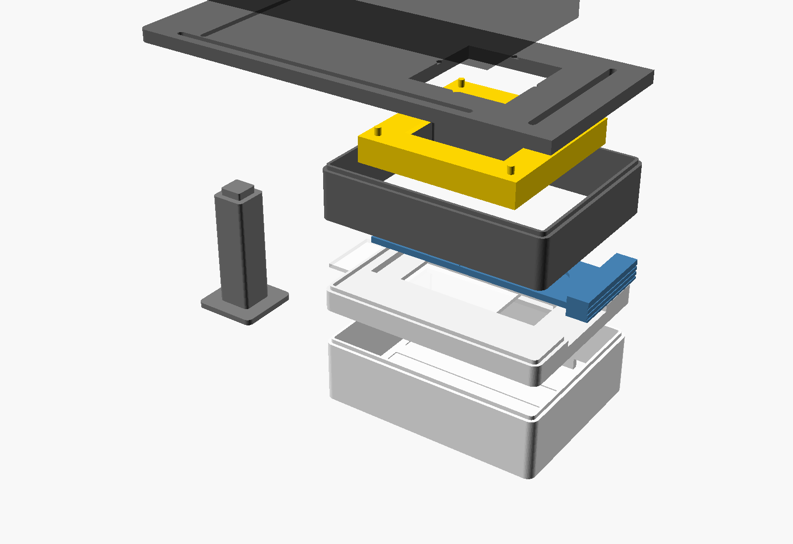
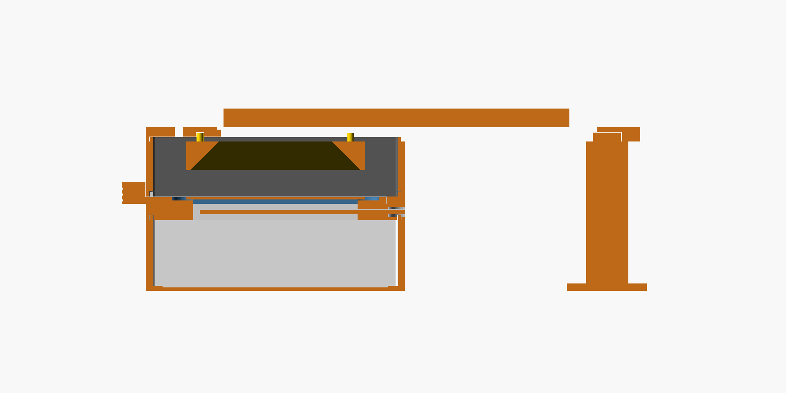

# Wingmate-Rig – 3D-druckbarer Aufnahmeaufbau

Ein Kasten, auf den das iPhone gelegt wird: immer **gleicher Abstand**, **gleiches Licht**, **gleicher
Hintergrund**. Unten ein LED-Leuchtkasten (Durchlicht für die Aderung), darüber eine Schublade für
den Objektträger, eine dunkle Kammer und oben die Handyauflage. Für WIP gibt es eine schwarze
Schublade und einen (experimentellen) Lichtring um die Kamera.





Ausgelegt für: **iPhone mit eigenem Makromodus** (Ultraweitwinkel, fokussiert ab ca. 2 cm),
**COB-LED-Streifen + Diffusor**, **Druckbett 220 × 220 mm**. Alles ist parametrisch
(`wingmate-rig.scad`) und lässt sich im OpenSCAD-Customizer anpassen.

> **Stand:** entworfen, gerendert und auf Kollisionen geprüft (`check.sh`), aber **noch nicht
> gedruckt**. Zuerst die Passung testen (Abschnitt „Zuerst testen“).

---

## Teile drucken

Die fertigen STL liegen in `stl/`. Neu erzeugen: `./build.sh` (siehe „Anpassen“).

| Datei | Anzahl | Farbe | Lage im Drucker | Hinweise |
| --- | --- | --- | --- | --- |
| `base.stl` | 1 | **weiß** | Öffnung nach oben | Innen weiß = Reflektor. Rillen im Boden für 3 LED-Reihen. |
| `stage.stl` | 1 | **weiß** | Oberseite nach oben | Diffusorschlitz = 30-mm-Brücke: Lüfter 100 %. Optional Stützen im Schlitz (von der offenen Seite herausziehbar). |
| `carrier.stl` | 1 | **weiß** | flach | Schublade Durchlicht. Weiß, damit der sichtbare Rahmen nicht völlig schwarz ist (hilft der Kalibrierung). |
| `carrier_wip.stl` | 1 | **schwarz matt** | flach | Schublade WIP, Mulde für Flockfolie unter dem Objektträger. |
| `tower.stl` | 1 | **schwarz matt** | stehend | Dunkelkammer; Höhe ergibt sich aus dem Arbeitsabstand. |
| `deck.stl` | 1 | **schwarz** | Oberseite nach oben | 210 × 86 mm. Kamerafenster, 3 Schlitze für Anschläge, Aufnahme für die Stütze. |
| `leg.stl` | 1 | beliebig | stehend | Stütze unter dem überstehenden Ende. Nach Änderung von `spacer_count` neu drucken. |
| `stop.stl` | 3 | beliebig | Anlagefläche stehend | Handy-Anschläge. |
| `knob.stl` | 3 | beliebig | Sechskant oben | Rändelmutter mit M3-Mutterfalle (Mutter einpressen). |
| `ring.stl` | 1 | **weiß** | Stifte nach oben | *Experimentell* – WIP-Lichtring; Innenflächen 45°. |
| `spacer.stl` | 0–4 | schwarz | stehend | Je +5 mm Arbeitsabstand, zwischen Kammer und Auflage. |
| `diffuser.stl` | 0–1 | **weiß** | flach, 100 % Infill | Nur falls kein Opal-Acrylglas: gedruckter Diffusor (sichtbare Struktur möglich). |

Allgemein: PLA oder PETG, 0,2 mm Schicht, 3 Perimeter, 15–20 % Infill, keine Stützen nötig.
Gesamt ca. 150–200 g Filament. **Schwarz matt** für alles, was die Kamera außerhalb des Lichtfensters
sieht (Kammer, Auflage, WIP-Schublade); **weiß** für Lichtkasten, Bühne und Ring.

## Zukaufteile

| Teil | Menge | Hinweis |
| --- | --- | --- |
| COB-LED-Streifen **5 V USB**, neutralweiß **4000 K, CRI ≥ 90** | ~0,5 m | ca. 30 cm für den Lichtkasten (3 × 9 cm), ca. 20 cm für den Ring (4 × 4,5 cm). COB = durchgehender Lichtstrich, gleichmäßiger als Einzel-LEDs. |
| USB-Netzteil oder Powerbank | 1–2 | **Ohne Dimmer**: USB-Dimmer arbeiten meist mit PWM → Streifen im Bild. |
| Opal-Acrylglas (Milchglas) **87 × 30 × 2 mm** | 1 | Bester Diffusor; Baumarkt/Zuschnitt. Alternative: `diffuser.stl`. |
| Schwarze **Flockfolie** (Velours, selbstklebend) | 60 × 24 mm | In die Mulde der WIP-Schublade. |
| Objektträger 76 × 26 mm, Deckgläser 22 × 22 oder 24 × 50 mm | nach Bedarf | Flügel mit einem Tropfen **70 % Ethanol** flach legen, Deckglas auflegen. |
| M3 × 16 Schrauben, M3-Muttern, Unterlegscheiben | je 3 | Für die Anschläge. |
| Objektmikrometer oder Lineal-Objektträger (1 mm / 0,01 mm) | 1 | Für die mm-Kalibrierung. |
| Graukarte 18 % | 1 | Optional, für WIP-Farbkorrektur (auf 76 × 26 mm zuschneiden). |
| Litze, Lötkolben, Schrumpfschlauch | – | Für die Verbindung der LED-Abschnitte. |

## Elektrik

- **Lichtkasten:** COB-Streifen in drei Stücke à ~9 cm an den Schnittmarken teilen, in die drei
  Bodenrillen kleben (Kupferpads zur selben Seite). Die Reihen **parallel** verbinden (+ an +, − an −)
  und das Stück mit dem USB-Stecker behalten. Kabel durch die Aussparung hinten unten.
- **Ring (WIP):** vier Stücke à ~4,5 cm auf die schrägen Innenflächen kleben, parallel verbinden,
  eigenes USB-Kabel durch die Aussparung oben hinten in der Kammer.
- Umschalten = Stecker ziehen/stecken: **Durchlicht an, Ring aus** für Venation; **Ring an,
  Durchlicht aus** für WIP. Nie beides.

## Zusammenbau

1. Leuchtkasten (`base`) mit LEDs, darauf die Bühne (`stage`) – die Lippe rastet ein.
2. Diffusor von der Seite (−x, gegenüber dem Schubladengriff) in den Schlitz schieben, bis er bündig ist.
3. Dunkelkammer (`tower`) aufsetzen, ggf. Distanzrahmen (`spacer`).
4. Ring (`ring`) mit den vier Stiften von unten in die Auflage (`deck`) stecken.
5. M3-Schrauben von **unten** durch die Schlitze der Auflage, darauf Anschlag (`stop`) und
   Rändelmutter (`knob`). Schrauben über der Kammer vor dem Aufsetzen einsetzen.
6. Auflage aufsetzen, Stütze (`leg`) unter das überstehende Ende stecken.
7. Objektträger in die Schublade legen, Schublade bis zum Anschlag einschieben – der Griff dichtet
   die Öffnung gegen Licht ab.

## iPhone einrichten

1. Handy mit dem Display nach oben auf die Auflage legen, Kamera über dem Fenster.
2. Die **Ultraweitwinkel-Linse** (die das Makro macht) genau über die Mitte bringen: In Wingmate
   *Exemplar → Live-Kamera* öffnen; die Kerben am Fensterrand und die Mittelmarken der Schublade
   helfen. Dann die drei Anschläge an das Handy schieben und festdrehen. Ab jetzt liegt das Handy
   immer gleich.
3. In der Live-Kamera unter **Kamera** die rückseitige **Ultraweitwinkel-Kamera** wählen, falls
   angeboten. Die automatische Objektivumschaltung („Triple/Dual Camera“) verändert sonst Maßstab und
   Bild.
4. Schärfe prüfen: Die Anzeige **Fokus** sollte stabil hoch sein. Stellt Safari nicht scharf,
   einen Distanzrahmen einsetzen (+5 mm) und `leg` für `spacer_count = 1` neu drucken.

**Wichtig:** iPhone-Safari kann Fokus, Belichtung und Weißabgleich nicht sperren. Deshalb:
Umgebung konstant halten (Kasten geschlossen, gleiches Netzteil) und **immer mit der
Live-Kamera** aufnehmen – das Rig-Profil gilt nur für genau diese Auflösung. Fotos aus der
Kamera-App haben eine andere Auflösung; dafür greift die Rig-Korrektur nicht.

## In Wingmate kalibrieren (Pflicht)

Die Ultraweitwinkel-Kamera sieht bei 25 mm etwa 60 × 45 mm – mehr als der Objektträger. Im Bild
sind daher neben dem hellen Lichtfenster auch Teile der Schublade zu sehen. Die Flügelerkennung
ohne Rig-Profil (Hintergrund = Bildrand) würde daran scheitern; mit Profil vergleicht Wingmate jedes
Pixel mit dem leeren Rig, und der Rahmen stört nicht.

*Einstellungen → Aufnahme-Rig → Mit der Live-Kamera kalibrieren* (siehe Benutzerhandbuch,
Kapitel 3):

1. **Venation-Hintergrund:** leerer Objektträger in der weißen Schublade, Durchlicht an.
2. **WIP-Hintergrund:** leerer Objektträger in der schwarzen Schublade, Ring an.
3. **WIP-Graukarte** (optional): Graukarte in der schwarzen Schublade, Ring an.
4. **Maßstab:** Objektmikrometer in der Schublade; zwei Teilstriche anklicken, Abstand in mm.
5. Speichern. Bei jeder Änderung an Licht, Diffusor, Distanz oder Telefon neu kalibrieren.

## Zuerst testen

Vor dem kompletten Druck (ca. 2 h):

1. `stage.stl` und `carrier.stl` drucken. Schublade muss leicht gleiten, Objektträger locker in der
   Mulde liegen, Diffusor in den Schlitz passen. Zu stramm/locker → `tol` ändern (Standard 0,25 mm).
2. `tower.stl` auf `stage.stl` setzen: Die Lippe soll ohne Kraft einrasten.
3. Handy provisorisch auf der Kammer: Stellt die Live-Kamera bei 25 mm scharf?

## WIP-Beleuchtung (experimentell)

WIP-Farben entstehen durch Interferenz und hängen stark vom Licht- und Blickwinkel ab
(Literatur: schwarzer Untergrund, helles, gerichtetes Licht). Bei 25 mm Arbeitsabstand trifft das
Licht des Rings unter etwa 60° zur Senkrechten auf den Flügel. Ob das für Ihre Arten genügend Farbe
zeigt, muss getestet werden. Stellschrauben: größerer Arbeitsabstand (Distanzrahmen) = Licht steiler
von oben, näher an der Kameraachse; Ringhöhe im Code (`ring`, h = 12); Diffusion (weißes Papier vor
den LEDs). Venation (Landmarken) hat Vorrang; WIP ist ein Zusatz.

## Anpassen

Im OpenSCAD-Customizer (Fenster → Customizer) oder per Kommandozeile:

| Parameter | Standard | Bedeutung |
| --- | --- | --- |
| `working_distance` | 25 | Linse → Flügel in mm (bestimmt die Kammerhöhe). |
| `spacer_count` | 0 | Anzahl 5-mm-Distanzrahmen; danach `leg` neu drucken. |
| `camera_bump` | 4,5 | Wie weit das Kameramodul hervorsteht (iPhone Pro: ca. 4–5 mm; messen!). |
| `window_size` | 46 × 46 | Kamerafenster; muss das ganze Kameramodul aufnehmen. |
| `deck_extension` | 100 | Überstand der Auflage für den Handykörper. |
| `tol` | 0,25 | Spiel für Passungen. |
| `slide`, `diffuser`, `light_window` | 76 × 26 × 1 · 87 × 30 × 2 · 70 × 22 | Objektträger, Diffusor, Lichtfenster. |

```bash
./build.sh -D working_distance=30 -D camera_bump=4   # alle STL + Vorschaubilder
./check.sh -D working_distance=30                    # Kollisionsprüfung aller Teile
openscad -D 'part="stage"' -o stage.stl wingmate-rig.scad   # ein Teil
```

`build.sh` und `check.sh` verwenden `openscad` aus dem Pfad oder `OPENSCAD=/pfad/zu/openscad`.
Die Konsole zeigt `RIG … effective_working_distance=… total_height=…` zur Kontrolle.

## Bekannte Grenzen

- Nicht gedruckt getestet – Passungen und Lichtdichtheit am ersten Druck prüfen.
- Handypositionierung über Anschläge statt modellspezifischer Halterung: einmal einstellen, dann
  wiederholbar. Für ein bestimmtes Modell lässt sich eine passgenaue Schale ergänzen.
- WIP-Ring: Winkel und Helligkeit unerprobt.
- Maßstab und Rig-Profil gelten für eine Konfiguration; nach jeder Änderung neu kalibrieren.
